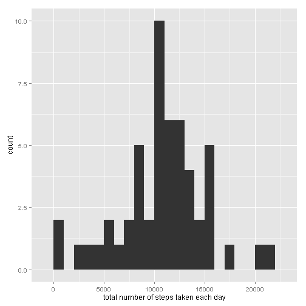
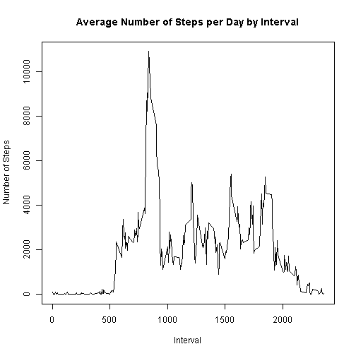
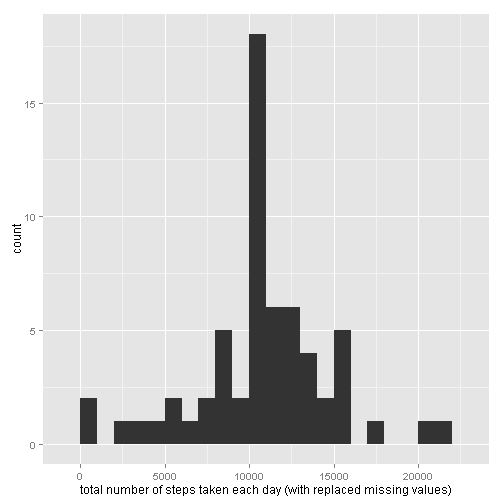
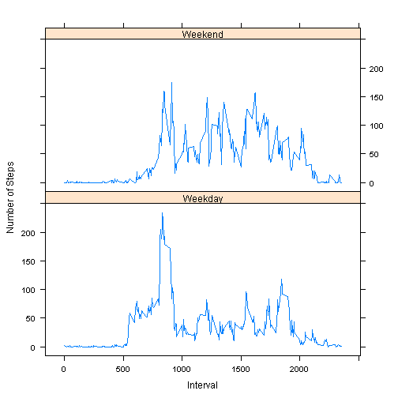

## Loading and preprocessing the data

```r
library(dplyr)
myData <- read.csv(".\\Data\\activity.csv")

# stepsData - sum of steps per day
by_days <- group_by(myData, date)
aggregated_data <- summarise(by_days, sum_steps = sum(steps))
stepsData <- aggregated_data$sum_steps
```

## Mean total number of steps per day

```r
library(ggplot2)
graph1 <- qplot(stepsData, binwidth = 1000, xlab = "total number of steps taken each day") 
print(graph1)
```

 

```r
meanSteps <- mean(stepsData, na.rm = TRUE)
print(meanSteps)
```

```
## [1] 10766.19
```

```r
medianSteps <- median(stepsData, na.rm = TRUE)
print(medianSteps)
```

```
## [1] 10765
```

## Daily average activity pattern

```r
# aggregated_inteval_data - number of steps per time interval
omitData <- na.omit(myData)
by_interval <- group_by(omitData, interval)
aggregated_interval_data <- summarise(by_interval, sum_steps = sum(steps))
intervalData <- aggregated_interval_data$sum_steps

plot(aggregated_interval_data$interval,aggregated_interval_data$sum_steps, type="l", 
     xlab="Interval", ylab="Number of Steps",main="Average Number of Steps per Day by Interval")
```

 
## Imputing missing values

### How many missing values

```r
missing <- is.na(myData$steps)
table(missing)
```

```
## missing
## FALSE  TRUE 
## 15264  2304
```

### Devise strategy for filling in all of the missing numbers

```r
# intervalAvgData - mean number of steps per time interval
by_interval_avg <- group_by(omitData, interval)
intervalAvgData <- summarise(by_interval_avg, avgSteps = mean(steps) )
```

### Create a new dataset that is equal to the original dataset but with the missing data filled in

```r
#imputed - myData with one added column - the mean number of steps for that time interval
mrg <- merge.data.frame(myData, intervalAvgData, by = "interval")
imputed <- mutate(mrg, imputed_steps = ifelse(is.na(mrg$steps), avgSteps, mrg$steps ))
```

### Histogram of the total number of steps taken each day


```r
by_days <- group_by(imputed, date)
aggregated_imputed_data <- summarise(by_days, sum_steps = sum(steps), sumImpSteps = sum(imputed_steps))
mStepsData <- aggregated_imputed_data$sumImpSteps
qplot(mStepsData, binwidth = 1000, xlab = "total number of steps taken each day (with replaced missing values)") 
```

 


### Mean and median

```r
meanImputedSteps <- mean(mStepsData, na.rm = TRUE)
print(meanImputedSteps)
```

```
## [1] 10766.19
```

```r
medianImputedSteps <- median(mStepsData, na.rm = TRUE)
print(medianImputedSteps)
```

```
## [1] 10766.19
```


## Diference in activity pattern between weekdays and weekends

```r
library(lubridate)
weekdays <- mutate(omitData, dateField = as.Date(date) )
weekdays <- mutate(weekdays, weekday = wday(dateField))
weekdays <- mutate(weekdays, weekend = as.factor( ifelse(weekday == 1 | weekday == 7, "Weekend", "Weekday")))

by_weekend <- group_by (weekdays, interval, weekend)
aggregated_weekend <- summarise(by_weekend, avg_steps = mean(steps))

library(lattice)
xyplot(avg_steps~interval | weekend, data = aggregated_weekend,
       type = 'l',
       xlab = 'Interval',
       ylab = 'Number of Steps',
       layout = c(1,2))
```

 


